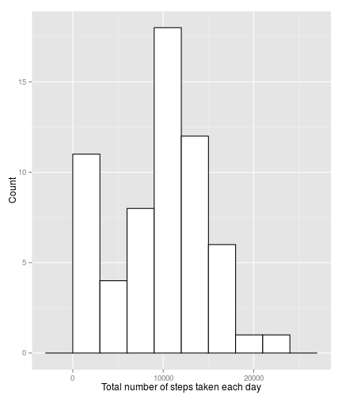
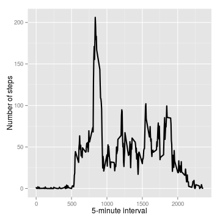
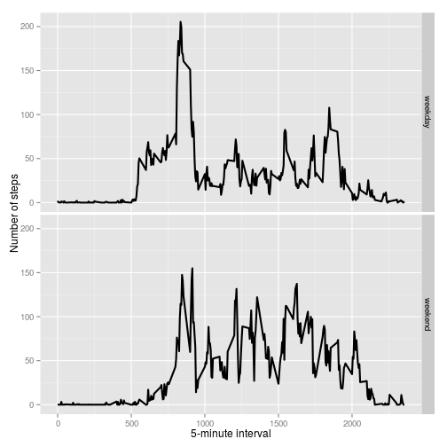

## Loading packages 

```r
library(lubridate)
library(dplyr)
library(ggplot2)
```


## Loading and preprocessing the data


```r
if ( !file.exists("activity.csv") )
{
     unzip("activity.zip")  
}

Activity <- read.csv(file="activity.csv")

Activity$date <- ymd(Activity$date)
```


## What is mean total number of steps taken per day?

**Calculate the total number of steps taken per day**


```r
tot.num.steps <- Activity  %>% group_by( date) %>%
                 summarise(total = sum(steps, na.rm = TRUE))

tot.num.steps
```

```
## Source: local data frame [61 x 2]
## 
##          date total
## 1  2012-10-01     0
## 2  2012-10-02   126
## 3  2012-10-03 11352
## 4  2012-10-04 12116
## 5  2012-10-05 13294
## 6  2012-10-06 15420
## 7  2012-10-07 11015
## 8  2012-10-08     0
## 9  2012-10-09 12811
## 10 2012-10-10  9900
## ..        ...   ...
```

**Make a histogram of the total number of steps taken each day**


```r
ggplot(tot.num.steps, aes(x=total)) +
      geom_histogram(binwidth=3000, colour="black", fill="white") + 
      xlab("Total number of steps taken each day") + 
      ylab("Count")
```

 

**Calculate and report the mean and median of the total number of steps taken per day**


```r
mean.median <- tot.num.steps %>% 
               summarise(  mean = mean(total, na.rm = TRUE)
                          ,median = median(total, na.rm = TRUE) )
    

mean.median 
```

```
## Source: local data frame [1 x 2]
## 
##      mean median
## 1 9354.23  10395
```


To answer the question: What is mean total number of steps taken per day?

**The mean total number of steps taken per day is 9354**.

## What is the average daily activity pattern?

1. Make a time series plot (i.e. type = "l") of the 5-minute interval (x-axis) and the average number of steps taken, averaged across all days (y-axis)


```r
avg.interval.steps <- Activity  %>% group_by( interval ) %>%
                      summarise(average = mean(steps, na.rm = TRUE))
```


```r
g <- ggplot(data =avg.interval.steps, 
            aes( x= interval, y=average ))


g <- g + geom_line(size = 1.0) + xlab("5-minute interval") +  ylab("Number of steps")

print(g)
```

 

2. Which 5-minute interval, on average across all the days in the dataset, contains the maximum number of steps?


```r
max.position <- which.max(avg.interval.steps$average)

avg.interval.steps[max.position, ]
```

```
## Source: local data frame [1 x 2]
## 
##   interval  average
## 1      835 206.1698
```

The 5-minute interval which contains the maximum number of steps is: 835-840, that is to say, near midday . 

To answer the question: What is the average daily activity pattern?

**Firstly the above graph shows that at the beginning and the end of the day, the number of steps is low. Secondly, there is a high peak near of the midday which makes sense. Lastly, between 1000 and 1800 (5-minute interval) the average of the number of steps is about 50**.


## Imputing missing values

1. Calculate and report the total number of missing values in the dataset (i.e. the total number of rows with NAs)


```r
total.na  <- sum(is.na(Activity$steps))
total.na 
```

```
## [1] 2304
```

2. Devise a strategy for filling in all of the missing values in the dataset. The strategy does not need to be sophisticated. For example, you could use the mean/median for that day, or the mean for that 5-minute interval, etc.


**The following strategy was devised: the median for that 5-minute interval was used for filling the missing values due to the median is a robust measure of central tendency**.


3. Create a new dataset that is equal to the original dataset but with the missing data filled in.


```r
new.Activity <- Activity  %>%  group_by( interval ) %>% 
                mutate( median.interval = median(steps, na.rm = TRUE ) ) 
            
  
new.Activity <- new.Activity %>%  
                mutate( steps = ifelse(is.na(steps), median.interval, steps) )
  

new.Activity$median.interval <- NULL
```

4. Make a histogram of the total number of steps taken each day and Calculate and report the mean and median total number of steps taken per day. Do these values differ from the estimates from the first part of the assignment? What is the impact of imputing missing data on the estimates of the total daily number of steps?


**Calculate the total number of steps taken per day for the imputed data**


```r
tot.num.steps <- new.Activity  %>% group_by( date) %>%
                 summarise(total = sum(steps, na.rm = TRUE))

tot.num.steps
```

```
## Source: local data frame [61 x 2]
## 
##          date total
## 1  2012-10-01  1141
## 2  2012-10-02   126
## 3  2012-10-03 11352
## 4  2012-10-04 12116
## 5  2012-10-05 13294
## 6  2012-10-06 15420
## 7  2012-10-07 11015
## 8  2012-10-08  1141
## 9  2012-10-09 12811
## 10 2012-10-10  9900
## ..        ...   ...
```

**Make a histogram of the total number of steps taken each day for the imputed data**


```r
ggplot(tot.num.steps, aes(x=total)) +
      geom_histogram(binwidth=3000, colour="black", fill="white") + 
      xlab("Total number of steps taken each day") + 
      ylab("Count")
```

 


**Calculate and report the mean and median of the total number of steps taken per day for the imputed data**


```r
mean.median <- tot.num.steps %>% 
               summarise(  mean = mean(total, na.rm = TRUE)
                          ,median = median(total, na.rm = TRUE) )
    

mean.median 
```

```
## Source: local data frame [1 x 2]
## 
##       mean median
## 1 9503.869  10395
```


## Are there differences in activity patterns between weekdays and weekends?

For this part the weekdays() function may be of some help here. Use the dataset with the filled-in missing values for this part.

1. Create a new factor variable in the dataset with two levels – “weekday” and “weekend” indicating whether a given date is a weekday or weekend day.


```r
new.Activity  <-  new.Activity %>%
                  mutate( temp = wday(date, label = T) ) 
    

new.Activity  <-  new.Activity %>%
                  mutate( type.of.day = 
                  ifelse(temp == "Sat" | temp == "Sun",
                  "weekend", "weekday") ) 
    

new.Activity$type.of.day <- as.factor(new.Activity$type.of.day)

new.Activity$temp <- NULL 
```


2. Make a panel plot containing a time series plot (i.e. type = "l") of the 5-minute interval (x-axis) and the average number of steps taken, averaged across all weekday days or weekend days (y-axis). See the README file in the GitHub repository to see an example of what this plot should look like using simulated data.


```r
avg.interval.steps <- new.Activity %>%  
                      group_by( interval, type.of.day ) %>%
                      summarise(average = mean(steps, na.rm = TRUE))
```


```r
g <- ggplot(data =avg.interval.steps, 
     aes( x= interval, y=average, fill=type.of.day ))


g <- g + geom_line(size = 1.0)

g <- g + xlab("5-minute interval") +  ylab("Number of steps")

g <- g + facet_grid( type.of.day ~ .)

print(g)
```

 

To answer the question: Are there differences in activity patterns between weekdays and weekends?

**In the first graph (weekday) it shows a high peak around midday, although the second graph (weekend) also shows this behavior, it is in lesser extent. Another alternative is to prove statistically that there are differences in activity patterns between weekdays and weekends, which is done by the granger test**.

